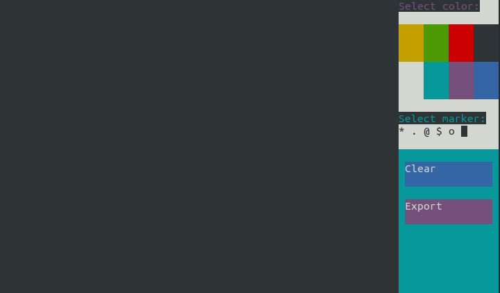

# Terminal Board
This is an application made as a submission for the PyDis Code Jam 2021.

The theme for the code jam is "Think inside the box."




## What is our program?
We interpreted the theme as a form of limitations and boudaries, and one of the common limitation of the terminal is the inability to do graphical stuff. So we decided to break this limitation and made a blackboard on terminal. You can draw, paint and do other cool stuff.  

## Installation
Please install the requirements using the command below
```shell
$ pip install -r requirements.txt
```
then you can just run the main.py script, like so
```shell
$ python main.py
```
## Team : Stylish Salamanders


## License
[MIT](https://choosealicense.com/licenses/mit/)
